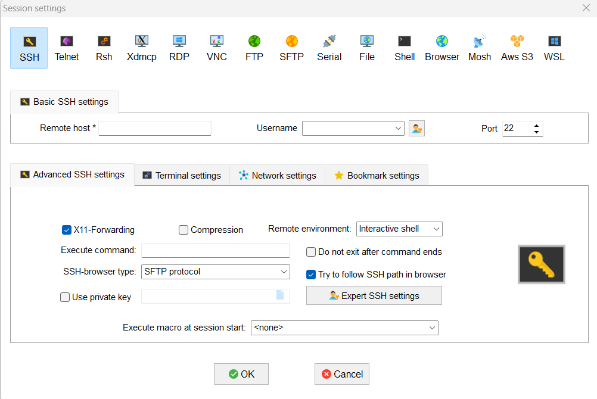

# Connecting to an EC2 instance using MobaXterm

**Tags:** #linux #aws #ec2 #ssh

## What you need
- Running EC2 instance with a public IP/DNS
- The `.pem` key file used when the instance was launched
- Port 22 open in the Security Group

## Steps
1. Open MobaXterm → **Session** → **SSH**
2. **Remote host:** EC2 public DNS/IP
3. Check **Specify username**, enter:
   - `ec2-user` (Amazon Linux)
   - `ubuntu` (Ubuntu)
   - `admin` (Debian)
   - `centos` (CentOS)
4. Go to **Advanced SSH settings** tab → check **Use private key** → select your `.pem` file
5. Click **OK**, accept the fingerprint prompt

## Notes
- Wrong username = most common connection error
- Stopped/started instance gets a new IP unless it has an Elastic IP
